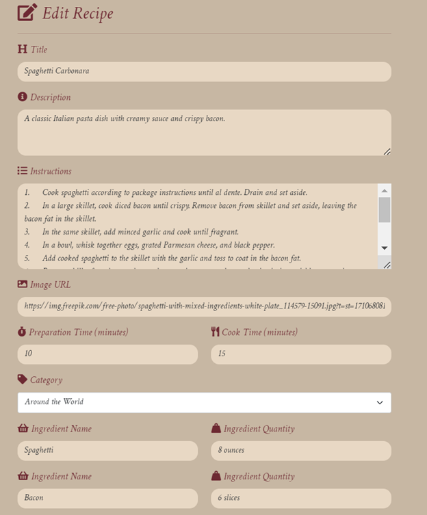
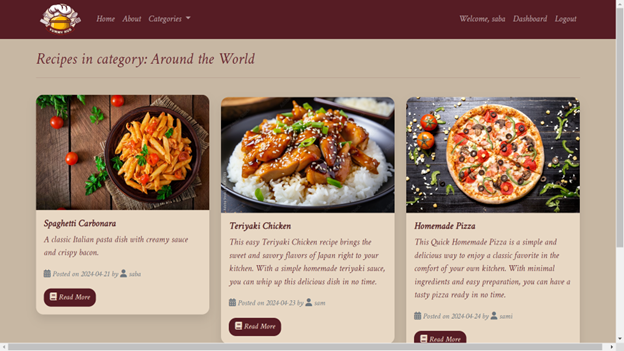
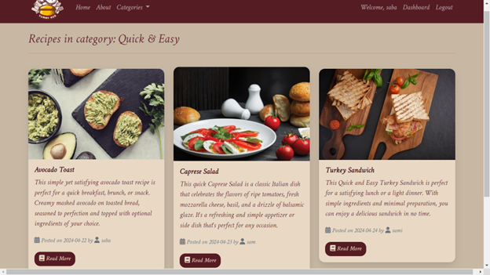
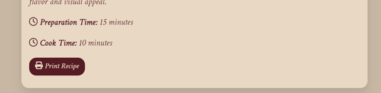
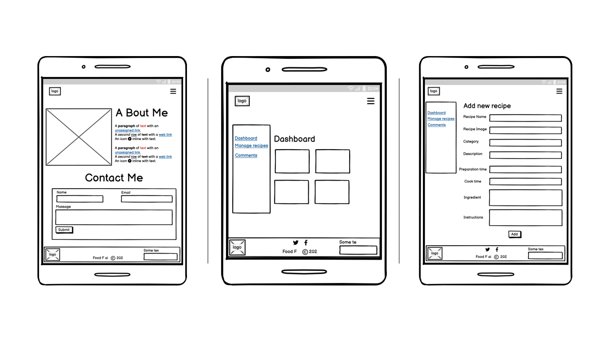
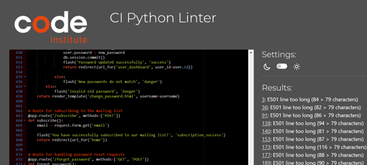

# Yummy Hub Recipe Manager

Welcome to Yummy Hub Recipe Manager! This is a web application designed to help you organize and discover delicious recipes from around the world.

[Live view for Yummy Hub](https://yummy-hub-777593069f12.herokuapp.com/)


## Table of Contents

1. [Introduction](#introduction)
2. [UX and UI](#ux-and-ui)
3. [Features](#features)
4. [Future Features](#future-features)
5. [Information Structure](#information-structure)
6. [Presentation](#presentation)
7. [Look and Feel](#look-and-feel)
8. [Technologies Used](#technologies-used)
9. [Wireframe](#wireframe)
10. [Database Structure](#database-structure)
11. [Getting Started](#getting-started)
12. [Deployment](#deployment)
13. [Testing](#testing)
    - [Manual Testing](#manual-testing)
    - [Automated Testing](#automated-testing)
    - [Client Stories Testing](#client-stories-testing)
    - [Compatibility and Responsive Testing](#compatibility-and-responsive-testing)
    - [Bugs and Fixes](#bugs-and-fixes)
14. [Credits](#credits)
15. [Contributing](#contributing)
16. [Acknowledgements](#acknowledgements)


## Introduction
Yummy Hub Recipe Manager is a convenient tool for storing, managing, and exploring recipes. Whether you're a cooking enthusiast, a professional chef, or someone looking to try out new dishes, this platform has got you covered.


## UX and UI
### Project and Customer Goals:
- **Project Goal:** Develop a web application named "Yummy Hub Recipe Manager" to help users organize, discover, and share recipes.

- **Customer Goal:** Provide users with a user-friendly platform where they can easily manage their recipe collections, explore new recipes, and engage with other users.

### Business Goal:
The business goal of Yummy Hub Recipe Manager is to attract and retain users by offering a comprehensive and intuitive recipe management solution. By providing valuable features such as recipe management, categorization, search functionality, user accounts, recipe sharing, rate recipe and a responsive design, the platform aims to enhance user satisfaction and engagement.

### User Stories:
- As a user, I want to register an account, so I can save my favorite recipes and interact with the community.

- As a user, I want to add, edit, and delete recipes, so I can manage my recipe collection according to my preferences.

- As a user, I want to search for recipes using keywords and advanced search criteria, such as category, ingredients, and cooking time, enabling me to quickly discover recipes that align with my preferences.

- As a user, I want to rate recipes and add comments, so I can share my feedback and experiences with other users.

- As a user, I want to view statistics and insights about my recipe usage, so I can track my activity and engagement on the platform.

-  As a user, I want to print recipes so I can easily refer to them while cooking.

### Features

**User Authentication:**

- Users can register accounts with unique usernames and email addresses.
- Existing users can log in securely using their credentials.
- Sessions are managed to keep users authenticated across different pages.


**Recipe Management:**

- Users can add new recipes with titles, descriptions, instructions, images, preparation time, and cooking time.
- Recipes can be edited or deleted by the user who created them.
- Ingredients can be added to recipes, including names and quantities.




**Recipe Viewing and Browsing:**

- The top 3 recipes, based on rating, are displayed on the home page for users to browse.
- Users can view detailed information about each recipe, including ingredients, instructions, and images.
- Recipes can be categorized into predefined categories for easier browsing.





**Share Recipe:**
- Users can share their favorite recipes with friends and family through social media platforms or email.
- The share feature allows users to generate a unique link to a recipe that they can easily share with others.


**Search Functionality:**

- Users can search for recipes using keywords and advanced search criteria, such as category, ingredients, and cooking time, enabling them to quickly discover recipes that match their preferences.
- Search results are displayed in a user-friendly format, allowing users to easily navigate through the list of relevant recipes and find those of interest.


**User Interaction:**

- Users can rate recipes to provide feedback on their experiences.
- Both registered users and guests can add comments. Guests can do so by entering their name and email.
- Users have the ability to create, read, update, and delete (CRUD) comments associated with recipes.
- Comments can be added to recipes, allowing users to share tips, modifications, and reviews.
- Comments are associated with user accounts and displayed alongside recipes.


**User Dashboard:**

- Users have access to a personalized dashboard where they can view statistics and insights about their recipe usage.
- Statistics may include total recipes, total comments, average rating, most commented recipe, etc.


**User Profile:**

- Users can view and edit their profile information, including username and email address.
- Profile information is stored securely and can be updated as needed.


**Change Password:**

- Users can securely change their passwords to enhance account security.
- Password change functionality ensures that users can update their passwords easily and efficiently.


**Print Recipe Functionality:**

- Users can print recipes directly from the web application, allowing them to access recipes offline or share them with others.
- Printed recipes are formatted in a user-friendly layout, ensuring clear and concise presentation of ingredients, instructions, and other details.
- This functionality provides users with the flexibility to conveniently reference recipes without requiring access to the online platform.




**Session Management:**

- Sessions are managed securely to ensure user data privacy and prevent unauthorized access.
- Users are redirected to appropriate pages based on their authentication status and actions performed.


**Error Handling:**

- Error handling is implemented to provide users with clear and informative error messages in case of invalid inputs or other issues.
- Flash messages are used to display notifications, such as successful actions or errors, to users.


**Responsive Design:**

- The web application is designed with a responsive layout, ensuring optimal viewing and interaction experiences across various devices and screen sizes.


These features collectively contribute to the functionality and usability of the Yummy Hub Recipe Manager web application, providing users with a seamless experience for managing, exploring, and sharing recipes.

### Future Features:
- **Social Sharing:** Integrate social media sharing functionality to allow users to share their favorite recipes with their friends and followers.

- **Recipe Recommendations:** Implement recommendation algorithms to suggest recipes based on user behavior, preferences, and ratings.

- **Advanced Search Filters:** Enhance the search functionality with advanced filters such as dietary restrictions, cooking techniques, and recipe ratings.

- **Collaborative Features:** Introduce collaborative features such as recipe collections, group meal planning, and community forums to foster interaction and collaboration among users.

- **Enhanced User Profiles:** Expand profiles with more details and customization.

- **Notification System:** Alert users about comments, recommendations, and updates.

### Information Structure:
The application is structured around the following key components:

- **Users:** Users can register, log in, and manage their accounts to access personalized features and interact with the platform.

- **Recipes:** Recipes serve as the core content of the application, allowing users to add, edit, delete, rate, and comment on recipes.

- **Categories:** Recipes are organized into categories such as "Around the World," "Quick & Easy," "Healthy Food," and "Sweet Treats" to facilitate browsing and discovery.

- **Comments:** Users can add comments to recipes to share their thoughts, tips, and modifications with other users.

- **Search:** The search functionality enables users to search for recipes based on keywords,to find recipes that match their preferences.

### Presentation:
The application is presented through a web interface with a clean and modern design. Users can navigate through different pages, view recipes, add comments, and interact with various features through intuitive user interfaces and interactive components.

### Look and Feel:
The application features a visually appealing design with a clean layout, modern typography, and vibrant colors. The user interface is designed to be user-friendly and accessible, with clear navigation, intuitive controls, and consistent visual elements throughout the application.

I utilized Color Hunt to select my color palette for the app.


### Technologies Used:
The application is developed using the following technologies and frameworks:

- **Python Flask:** Flask is utilized as the web framework for constructing the backend server and handling HTTP requests.

- **SQLAlchemy:** SQLAlchemy serves as the Object-Relational Mapping (ORM) tool for interacting with the database and managing data models.

- **HTML/CSS:** HTML and CSS are employed for structuring and styling the web pages to create the user interface.

- **JavaScript:** JavaScript is integrated to add interactivity and dynamic behavior to the web pages, including form validation and asynchronous requests.

- **Jinja2:** Jinja2 is the template engine used for generating dynamic HTML content with data from the backend.

- **PostgreSQL** (ElephantSQL): ElephantSQL provides a PostgreSQL database for storing user accounts, recipes, comments, and other application data. It enhances scalability and performance compared to SQLite, facilitating seamless application operation.

- **Heroku:** Heroku is utilized as the deployment platform, enabling easy deployment and scaling of the Flask application. It also hosts the PostgreSQL database add-on provided by ElephantSQL, ensuring robustness and reliability of the application's data storage.

### Wireframe
My initial ideas, after conducting research, were sketched out using Balsamiq. This method proved effective as it allowed me to gather my thoughts and assess which ideas worked best. However, during the project's completion, I found myself not entirely satisfied with my initial proposals and opted for different ideas. Nonetheless, the overall structure of the wireframes remained consistent and was reflected in the final design.

#### Desktop


#### Small Screens




## Database Structure:
The database consists of the following tables:

### users:

| Column        | Data Type                    | Constraints                  |
|---------------|------------------------------|------------------------------|
| id            | Integer                      | Primary Key, Autoincrement   |
| username      | String(50)                   | Unique, Not Null             |
| email         | String(100)                  | Unique, Not Null             |
| password      | String(100)                  | Not Null                     |
| created_at    | Timestamp                    | Default: Current Timestamp   |

### recipes:

| Column             | Data Type                    | Constraints                                          |
|--------------------|------------------------------|------------------------------------------------------|
| id                 | Integer                      | Primary Key                                          |
| title              | String(100)                  | Not Null                                             |
| description        | Text                         |                                                      |
| instructions       | Text                         |                                                      |
| user_id            | Integer                      | Foreign Key to users.id                              |
| category_name      | String(50)                   |                                                      |
| image_url          | String(255)                  |                                                      |
| preparation_time   | Integer                      |                                                      |
| cook_time          | Integer                      |                                                      |
| created_at         | Timestamp                    | Default: Current Timestamp                           |
| ingredients        | JSON                         |                                                      |
| unique_identifier  | String(36)                   | Unique, Not Null, Default: UUID                      |

### ratings:

| Column      | Data Type                    | Constraints                                          |
|-------------|------------------------------|------------------------------------------------------|
| id          | Integer                      | Primary Key                                          |
| rating      | Integer                      |                                                      |
| user_id     | Integer                      | Foreign Key to users.id                              |
| recipe_id   | Integer                      | Foreign Key to recipes.id                            |
| created_at  | Timestamp                    | Default: Current Timestamp                           |

### comments:

| Column      | Data Type                    | Constraints                                          |
|-------------|------------------------------|------------------------------------------------------|
| id          | Integer                      | Primary Key                                          |
| content     | Text                         | Not Null                                             |
| created_at  | Timestamp                    | Default: Current Timestamp                           |
| user_id     | Integer                      | Foreign Key to users.id                              |
| recipe_id   | Integer                      | Foreign Key to recipes.id                            |
| name        | String(100)                  |                                                      |
| email       | String(255)                  |                                                      |


## Getting Started

### Prerequisites
- Python 3.x
- pip (Python package manager)

### Installation
1. Clone the repository to local machine:
   ```sh
   git clone https://github.com/SABA-SALEH/yummy-hub.git
   ```

2. Navigate to the project directory:
   ```sh
   cd yummy-hub
   ```

3. Install the required dependencies:
    ```sh
   pip install -r requirements.txt
   ```

### Setting Up the Database
1. Create a PostgreSQL database either locally or using a cloud service like ElephantSQL.
2. Update the database connection URI in the __init__.py file:
SQLALCHEMY_DATABASE_URI = 'postgresql://'

### Running the Application
1. Start the Flask development server:
   ```sh
   python run.py
2. Open a web browser and navigate to http://localhost:5000 to access the application.

## Deployment

To deploy Yummy Hub Recipe Manager web application to Heroku, follow these steps:

1. Sign up for Heroku:

    - Navigate to Heroku.com in web browser.
    - Click on "Sign Up" and create a new account.
    - Fill out the registration form with  details and verify the account through the confirmation 
    email sent by Heroku.

2. Create a new app on Heroku:

    - Once logged in, click on the "New" button on the dashboard.
    - Choose a unique name for app (e.g., yummy-hub).
    - Select region preference.
    - Click on "Create App" to create app on Heroku.

3. Link  local Git repository to Heroku:

    - In terminal, navigate to project directory.
    - Add a new remote for Heroku by running the command:
    ```csharp
    git remote add heroku <heroku-git-url>
    ```
    - Verify that the remote has been added by running:
    ```csharp
    git remote -v
    ```

4. Create a requirements.txt file:

    - In terminal, run the command:
    ```csharp
    pip freeze > requirements.txt
    ```
    -This command will generate a requirements.txt file listing all Python dependencies used in project.

5. Create a Procfile:

    - In terminal, run the command:
    ```bash
    echo "web: python run.py" > Procfile
    ```

6. Commit changes and push to Heroku:

    - Add the requirements.txt and Procfile to Git repository:
    ```csharp
    git add requirements.txt Procfile
    ```
    - Commit the changes:
    ```sql
    git commit -m "Add requirements.txt and Procfile"
    ```
    - Push code to Heroku:
    ```perl
    git push -u heroku main
    ```

7. Set up environment variables on Heroku:

    - Go to Heroku dashboard and navigate to app's settings.
    - Click on "Reveal Config Vars".
    - Add any necessary environment variables, such as SECRET_KEY, IP, and PORT, and their respective values.

8. Check logs and troubleshoot if necessary:

    - Monitor the build process and check for any errors by viewing the logs on Heroku.
    - You can access logs through the Heroku dashboard or via the command line using:
    ```css
    heroku logs --tail --app yummy-hub
    ```
9. Test deployed app:

    - Once deployment is successful, visit app's URL provided by Heroku to ensure that it is working as expected.

   (Optional) Set up automatic deployment from GitHub:

    - In Heroku app's dashboard, navigate to the "Deploy" tab.
    - Connect GitHub repository to Heroku app.
    - Enable automatic deployments from chosen branch (e.g., main).

## Testing
### Manual Testing
#### User Authentication:
1.	User Registration:
	- Test registering with unique usernames and email addresses.
    - Ensure successful registration redirects users appropriately.


2.	User Login:
	- Test logging in with valid credentials.
	- Ensure login fails with incorrect credentials.
	- Verify that users are redirected to the appropriate pages after login.

#### Recipe Management:
3.	Adding Recipes:
	- Add new recipes with all required fields.
	- Verify that all recipe details are correctly saved in the database.

4.	Editing Recipes:
	- Edit existing recipes and ensure changes are updated correctly.
	- Test updating recipe details such as ingredients, instructions, and images.

5.	Deleting Recipes:
	- Delete recipes and confirm they are removed from the database.

#### Recipe Viewing and Browsing:
6.	Home Page Display:
	- Check if recipes are displayed on the home page.

7.	Recipe Details:
	- View detailed information about each recipe.
	- Test navigation to individual recipe pages.

8.	Category Browsing:
	- Browse recipes by categories and verify correct filtering.

#### Search Functionality:
9.	Keyword Search:
	- Test searching for recipes using various keywords.
	- Confirm that search results are relevant and accurate.

#### User Interaction:
10.	Rating Recipes:
	- Rate recipes and verify that ratings are saved and displayed correctly.

11.	Adding Comments:
	- Add comments to recipes and ensure they are associated 
    - Test displaying comments alongside recipes.

#### User Dashboard:
12.	Viewing Statistics:
    - Check if users can view statistics and insights about their recipe usage.
	- Verify that statistics such as total recipes, total comments, and average rating are accurate.

13.	User Profile:
	- Edit user profile information such as username and email address.
	- Ensure changes are saved correctly.

14. Change Password:
    - Test changing the password from the user dashboard.
    - Verify that users can update their passwords successfully.
    - Confirm that users receive appropriate feedback messages after changing their passwords.

#### Comments Management:
15. Adding Comments:
    - Add comments to recipes and ensure they are associated correctly.
    - Verify that comments are displayed alongside recipes.

16. Editing Comments:
    - Edit existing comments and ensure changes are updated correctly.
    - Test updating comment content.

17. Deleting Comments:
    - Delete comments and confirm they are removed from the database.
    - Verify that associated recipes are updated accordingly.

#### Error Handling:
18.	Invalid Inputs:
	- Test submitting forms with invalid data and verify appropriate error messages.

19.	Flash Messages:
	- Confirm that flash messages are displayed for successful actions and errors.

#### Responsive Design:
16.	Desktop and Mobile Devices:
	- Test the application on different screen sizes to ensure responsiveness.
	- Verify that all features and functionalities work well on both desktop and mobile devices.

### Automated Testing
#### Code Validation:
1.	HTML Validator:
	- Validate HTML code for all pages to ensure compliance with standards.

    
    
    


2.	CSS Validator:
	- Check stylesheets for compliance with CSS standards and fix any issues.

    


3.	JS Validator:
	- Validate JavaScript code syntax and maintain code quality.

    

4. Python Linter:
   - Use a Python linter to validate Python code syntax and maintain code quality.

   
   
   


#### Lighthouse Audit:
1.  Assess performance, accessibility, and best practices using Lighthouse.
2.  Optimize performance and address any identified issues.

 


### Client Stories Testing
#### Client Story 1:
1. Registration and Account Management:
    - Test user registration process.
	- Verify that users can manage their accounts effectively.

#### Client Story 2:
1. Recipe Management:
	- Test adding, editing, and deleting recipes.
	- Confirm that users can manage their recipe collections efficiently.

#### Client Story 3:
1. Search and Browsing:
	- Test search functionality and category browsing.
	- Ensure users can find recipes easily based on their preferences.

#### Client Story 4:
1. Interaction and Engagement:
	- Test rating recipes and adding comments.
	- Verify that users can interact with recipes and engage with the community.

#### Client Story 5:
1.	Personalization and Insights:
	- Check if users can view statistics and insights about their recipe usage.
	- Ensure personalized experience based on user activity.

#### Client Story 6:
1. Error Handling and User Experience:
	- Test error handling and user feedback mechanisms.
	- Verify that users receive clear and informative messages.

### Compatibility and Responsive Testing
#### Browser Testing:
1.	Google Chrome:
	- Test the application thoroughly on Google Chrome to ensure compatibility and functionality.


2.	Mozilla Firefox:
	- Verify compatibility and functionality on Mozilla Firefox.


3.	Microsoft Edge:
	- Test on Microsoft Edge to ensure seamless user experience.
    
    
#### Mobile Testing:
1.	iPhone and Android Devices:
	- Test the application on various mobile devices to ensure compatibility and responsiveness.
	- Verify that all features work well on mobile browsers such as Chrome and Safari.
    
       

## Bugs and Fixes:

### Issue 1: Creating a Special Shareable Link for Each Recipe

- Bug: While developing the application, I encountered an issue where there was no functionality to create a unique shareable link for each recipe. This limitation made it challenging for users to share specific recipes with others.

- Fix: To address this issue, I implemented a solution within my codebase. I created a new route /share_recipe/<unique_identifier> to handle the generation of special shareable links. This route takes a unique_identifier parameter, which represents a unique identifier associated with each recipe. Inside the route, I queried the recipe using its unique identifier. If the recipe was found, I rendered the shareable_link.html template, passing the unique identifier as a parameter. This template would display the shareable link for the recipe. If the recipe was not found, I redirected the user to the home page with a flash message indicating that the recipe was not found.

Here's the relevant code snippet from my application:
```bash
# Route for sharing a recipe
@app.route('/share_recipe/<string:unique_identifier>', methods=['GET'])
def share_recipe(unique_identifier):
    print("Share Recipe Route Accessed")
    try:
        # Try to convert the unique_identifier to UUID
        unique_identifier = UUID(unique_identifier)
    except ValueError:
        # If conversion fails, handle the error 
        flash('Invalid recipe identifier!', 'danger')
        return redirect(url_for('home'))

    # Query the recipe by its unique identifier
    recipe = Recipe.query.filter(cast(Recipe.unique_identifier, String) == str(unique_identifier)).first()


```
       
### Issue 2: Allowing Users and Guests to Add Comments and Associate Them with Recipes

- Bug: During development, it was identified that there was no functionality for both registered users and guests to add comments to recipes. Additionally, there was no association between the comments and the specific recipes they were related to.

- Fix: To address this issue, I implemented a solution that allows both users and guests to add comments and associate them with recipes. First, I created a route /recipe/<uuid:unique_identifier> to handle the display of recipe details, including any existing comments. Then, I modified this route to handle both GET and POST requests. For GET requests, it retrieves the recipe details and associated comments from the database. For POST requests, it checks whether the user is authenticated. If the user is authenticated, it adds the comment to the database with the user's ID. If the user is not authenticated (guest user), it adds the comment with the provided name and email. This ensures that comments are associated with the correct recipe and attributed to the appropriate user or guest.

Here's the relevant code snippet from my application:
```bash
# Route for viewing recipe details
@app.route('/recipe/<uuid:unique_identifier>', methods=['GET', 'POST'])
def recipe_details(unique_identifier):
    # Query the recipe by its unique identifier
    recipe = Recipe.query.filter_by(unique_identifier=unique_identifier).first()

    # If the recipe is not found, redirect to the home page with a flash message
    if not recipe:
        flash('Recipe not found!', 'danger')
        return redirect(url_for('home'))

    # If the request method is POST
    if request.method == 'POST':
        # If the user is authenticated
        if 'user_id' in session:
            user_id = session['user_id']
            content = request.form.get('comment_content')
            # Check if the comment content is provided
            if content:
                # Create a new comment associated with the user
                new_comment = Comment(content=content, user_id=user_id, recipe_id=recipe.id)
                db.session.add(new_comment)
                db.session.commit()
                flash('Comment added successfully!', 'success')
            else:
                flash('Comment cannot be empty!', 'warning')
        else:
            # If the user is not authenticated (guest user)
            name = request.form.get('name')
            email = request.form.get('email')
            content = request.form.get('comment_content')
            # Check if name, email, and content are provided
            if name and email and content:
                # Create a new comment associated with the provided name and email
                new_comment = Comment(content=content, name=name, email=email, recipe_id=recipe.id)
                db.session.add(new_comment)
                db.session.commit()
                flash('Comment added successfully!', 'success')
            else:
                flash('Name, email, and comment content are required!', 'danger')

    # Render the recipe details template with the recipe, comments, and authentication status
    return render_template('recipe_details.html', recipe=recipe, authenticated='user_id' in sessio

```

### Issue 3: Adding Multiple Ingredients to a Recipe

- Bug: While implementing the functionality to add a new recipe, it was noticed that there was no support for adding multiple ingredients to a recipe. Only a single ingredient could be added at a time, limiting the flexibility and usability of the application.

- Fix: To resolve this issue and allow users to add multiple ingredients to a recipe, I extended the functionality of the recipe creation form to include fields for multiple ingredients. In the HTML form (add_recipe.html), I added input fields for ingredient names and quantities, allowing users to dynamically add more fields for additional ingredients if needed. Then, in the Flask route handling the submission of the form (/add_recipe), I modified the logic to iterate over the submitted form data to extract all ingredient names and quantities and add them to the recipe object before saving it to the database.

Here's the relevant code snippet from my application:
```bash
# Route for adding a new recipe
@app.route('/add_recipe', methods=['GET', 'POST'])
def add_recipe():
    # Redirect to login page if not logged in
    if 'username' not in session:
        return redirect(url_for('login'))

    username = session['username']
    if request.method == 'POST':
        # Retrieving form data
        title = request.form['title']
        description = request.form['description']
        instructions = request.form['instructions']
        category_name = request.form['category']
        preparation_time = request.form['preparation_time']
        cook_time = request.form['cook_time']
        image_url = request.form['image_url']
        user_id = session.get('user_id')
        
        # Creating a new recipe object
        new_recipe = Recipe(
            title=title,
            description=description,
            instructions=instructions,
            user_id=user_id,
            category_name=category_name,
            image_url=image_url,
            preparation_time=preparation_time,
            cook_time=cook_time
        )

        # Extracting multiple ingredients from the form
        ingredients = []
        for i in range(1, 11):
            ingredient_name = request.form.get(f'ingredient_name_{i}')
            ingredient_quantity = request.form.get(f'ingredient_quantity_{i}')
            if ingredient_name and ingredient_quantity:
                ingredients.append({ "name": ingredient_name, "quantity": ingredient_quantity})
        
        # Adding the extracted ingredients to the recipe object
        for ingredient in ingredients:
            new_recipe.add_ingredient(ingredient['name'], ingredient['quantity'])
        
        # Adding the new recipe to the database
        db.session.add(new_recipe)
        db.session.commit()

        return redirect(url_for('view_recipes', user_id=user_id))

    # Preparing categories for rendering in the template
    categories = [
        {'id': 1, 'name': 'Around the World'},
        {'id': 2, 'name': 'Quick & Easy'},
        {'id': 3, 'name': 'Healthy Food'},
        {'id': 4, 'name': 'Sweet Treats'}
    ]
    return render_template('add_recipe.html', categories=categories, username=username)
```

### Issue 4: Deleting a Recipe with Associated Ratings and Comments

- Bug: When attempting to delete a recipe, there was a missing functionality to also delete the associated ratings and comments for that recipe. This resulted in inconsistencies in the database and potential orphaned records.

- Fix: To address this issue and ensure data integrity when deleting a recipe, I enhanced the delete recipe functionality to also delete all associated ratings and comments before deleting the recipe itself. This ensures that there are no orphaned records left behind in the database.

Here's the updated code snippet from the Flask route handling the deletion of a recipe (/delete_recipe/<int:recipe_id>):

```bash
# Route for deleting a recipe
@app.route('/delete_recipe/<int:recipe_id>', methods=['POST'])
def delete_recipe(recipe_id):
    if 'username' not in session:
        flash('You must be logged in to delete recipes.', 'danger')
        return redirect(url_for('login'))
    user_id = session.get('user_id')
    # Query the recipe to be deleted
    recipe = Recipe.query.filter_by(id=recipe_id, user_id=user_id).first()
    if not recipe:
        flash('Recipe not found or you are not authorized to delete it.', 'danger')
        return redirect(url_for('manage_recipes'))
    try:
        # Deleting associated comments and ratings before deleting the recipe
        Comment.query.filter_by(recipe_id=recipe_id).delete()
        Rating.query.filter_by(recipe_id=recipe_id).delete()
        db.session.commit()
        db.session.delete(recipe)
        db.session.commit()
        flash('Recipe deleted successfully.', 'success')

    except Exception as e:
        # Handle errors
        flash('An error occurred while deleting the recipe.', 'danger')
        db.session.rollback()

    return redirect(url_for('manage_recipes'))
```

## Credits
- Project developed by SABA SALEH

- GitHub: Used for version control of project files.

- GitPod: An integrated development environment (IDE) used for coding.

- Heroku: Heroku - Platform-as-a-Service (PaaS) used for deploying and hosting the application.

- ElephantSQL: ElephantSQL - PostgreSQL database hosting service used for storing application data.

- Balsamiq: Used to create effective wireframes easily.

- W3Schools: For providing valuable resources and tutorials for web development.

- Favicon.io: Favicon.io - Source of the favicon used in the project.

- Bootstrap: Bootstrap - Framework for building responsive and visually appealing web pages.

- Font Awesome: Font Awesome - Icon toolkit used for adding scalable icons to the project.

- Logo designed using Canva

## Contributing
If you have ideas for improvements or new features, I welcome contributions. Fork the repository, make your changes, and submit a pull request. Together, let's enhance Yummy Hub and make it an even more useful tool for all users. Thank you for your contributions!

## Acknowledgements
I would like to express my sincere gratitude to the following individuals and organizations who have contributed to this project in various ways:

- Oluwafemi Medale: My mentor, for their guidance and valuable suggestions throughout the development of this project.

- Code Institute: For their support in providing resources for this project.

Finally, I want to express my appreciation to all the users and contributors who have provided feedback and helped improve this project.


